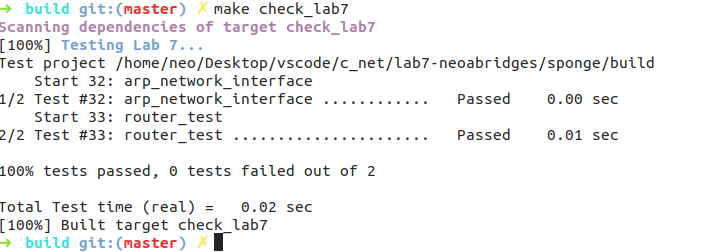
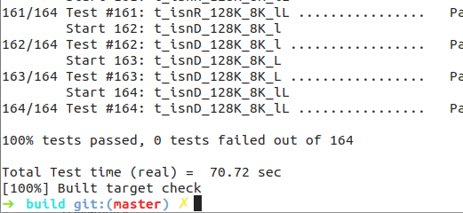

Lab 7 Writeup
=============

My name: [<font color="purple">刘轩昂</font>]

My Student number : [<font color="purple">201220198</font>]

This lab took me about [<font color="purple">5</font>] hours to do.

#### 1. Program Structure and Design:

本次实验要求实现基于最长前缀匹配规则的路由器转发功能：<br>
完成`router.hh`和`router.cc`即可。

#### 2. Implementation:

辅助变量和函数如下：
``` cpp
// router.hh
struct RouteEntry {
    uint32_t route_prefix = 0;
    uint8_t prefix_length = 0;
    std::optional<Address> next_hop = std::nullopt;
    size_t interface_num = 0;
};
    std::vector<RouteItem> _route_table{};
    bool prefix_equal(uint32_t ip1, uint32_t ip2, uint8_t len); // 前缀匹配
```
`prefix_equal()`的实现：
``` cpp
// router.cc
bool Router::prefix_equal(uint32_t ip1, uint32_t ip2, uint8_t len) {
    // special judge right when shift 32 bit
    uint32_t offset = (len == 0) ? 0 : 0xffffffff << (32 - len);
    printf("ip cmp: %x %x, offset: %x\n", ip1 & offset, ip2 & offset, offset);
    return (ip1 & offset) == (ip2 & offset);
}
```
其余函数的实现可见`router.cc`

#### 3. Tests:



**make check**：

